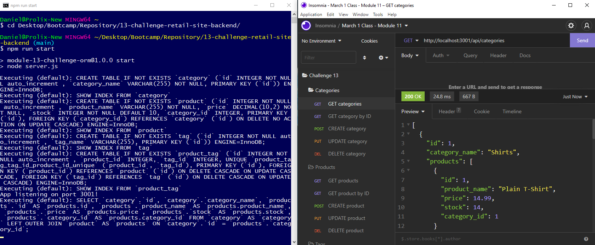

# E-Commerce Site Backend

[](https://opensource.org/licenses/MIT)

## Description
This application is a backend for an Internet retail company's e-commerce website. The server runs with Node and an Express API to use Sequelize and interact with a MySQL database. The app uses the Express, MySQL2, Sequelize, and dotenv packages. It synchronizes Sequelize models to a MySQL database upon server startup.




## Table of Contents
- [Video of the Application](#video-of-the-application)
- [User Story](#user-story)
- [Installation](#installation)
- [Usage](#usage)
- [Tests](#tests)
- [Author](#author)
- [License](#license)
- [Contributing](#contributing)
- [Questions](#questions)

## Video of the Application
The application can be seen in action at the following URL:

[https://drive.google.com/file/d/1oGxIgxHs4JwrHlaBVt9m8THDN30IpRRu/view](https://drive.google.com/file/d/1oGxIgxHs4JwrHlaBVt9m8THDN30IpRRu/view)

### User Story
This E-Commerce Site Backend was created to meet the requirements of the following user story:
```
AS A manager at an internet retail company
I WANT a back end for my e-commerce website that uses the latest technologies
SO THAT my company can compete with other e-commerce companies
```

## Installation
1. Clone the repository, or download and extract an archive of it
2. Run "npm install" to obtain the required dependencies

## Usage
1. Create a .env file (reference .env.example) and populate it with your MySQL database information
2. Invoke the app with "npm run start" or "node server.js"
3. Visit http://localhost:3001 to begin using the site

## Tests
There is no test suite associated with this application

## Author
Application written by Daniel Birmingham ([GitHub profile](https://github.com/Prolix19/)).

## License
[The MIT License](https://opensource.org/licenses/MIT)

## Contributing
As this project already meets all of its technical requirements, it is not open to contributions at this time.

## Questions
You may reach me via GitHub with any additional questions you may have.